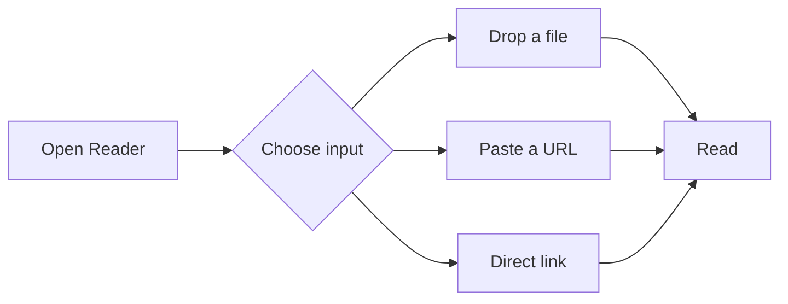

# Reader Feature Tour

This document demonstrates the rendering features supported by Reader.

## Text Formatting

Regular text with **bold**, *italics*, ~~strikethrough~~, and `inline code`. You can also combine **_bold italics_** or use [links](https://example.com) inline.

> Blockquotes are styled with a left border accent. They're great for callouts or quoting sources.
>
> > Nested blockquotes work too.

---

## Lists

- Unordered lists with bullet markers
- Nested items work naturally
  - Like this second level
  - And this one
- Back to the top level

1. Ordered lists are numbered
2. Second item
3. Third item

Task lists:

- [x] Completed task
- [x] Another done
- [ ] Still to do

## Code Blocks

```javascript
function greet(name) {
  const message = `Hello, ${name}!`;
  console.log(message);
  return message;
}

greet("Reader");
```

```python
def fibonacci(n):
    """Generate the first n Fibonacci numbers."""
    a, b = 0, 1
    for _ in range(n):
        yield a
        a, b = b, a + b

print(list(fibonacci(10)))
```

## Tables

| Feature | Supported |
|---------|-----------|
| GFM tables | Yes |
| Syntax highlighting | Yes |
| Mermaid diagrams | Yes |
| YAML frontmatter | Yes |
| Dark mode | Yes |

## Mermaid Diagrams



## Images

Markdown images render responsively with rounded corners:


## Headings at Every Level

### Third level
#### Fourth level
##### Fifth level
###### Sixth level

## Footnote-style Content

The table of contents in the sidebar is auto-generated from all the headings on this page. Open it by tapping the list icon in the top bar.
